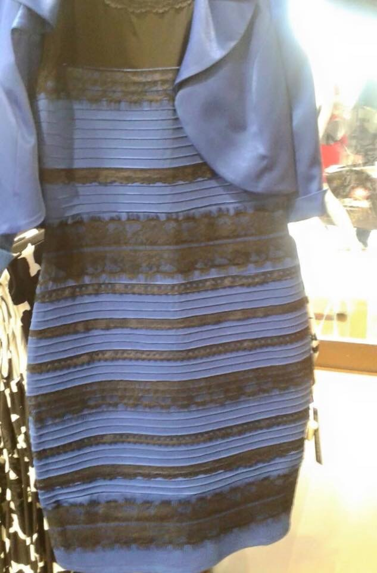
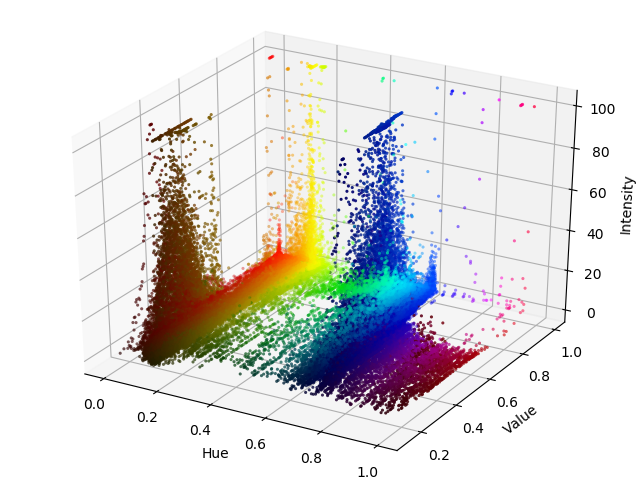

RGB Image Analysis with Python
==============================

Decompose an image file into a 3D color-space visualization

usage:

```console

# --- interactive (default)

foo@bar:~$ visualize_colors.py thedress.jpg 

# --- non-interactive

foo@bar:~$ visualize_colors.py thedress.jpg thedress.analysis.png
foo@bar:~$ feh thedress.analysis.png
```

</img>
</img>

changelog
---------

**0.2.0**

- fixes: does not work with Python3
- adds arguments-support: me.py <image_in> [<image_out>]
- adds doc
